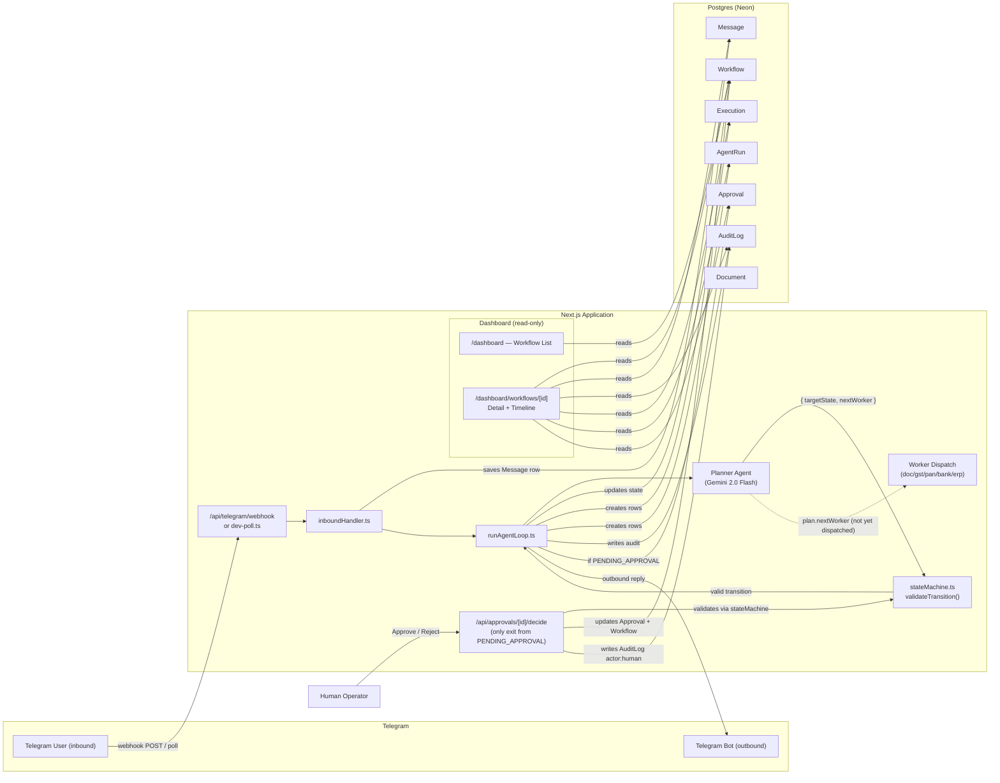

# Architecture — Operations OS

## Component Diagram

## What's Implemented vs. Mocked

| Component | Status | Details |
|---|---|---|
| **Prisma schema** | ✅ Implemented | 8 models: Vendor, Workflow, Execution, AgentRun, Message, Approval, AuditLog, Document. Fully migrated to Postgres (Neon). |
| **State machine** | ✅ Implemented | `stateMachine.ts` — 11 states, explicit transition map, `validateTransition()` throws on invalid moves. Unit tested. |
| **Audit logging** | ✅ Implemented | `writeAuditLog()` creates an AuditLog row on every state transition, capturing actor, action, from/to states, and metadata. |
| **Execution + AgentRun tracking** | ✅ Implemented | `runAgentLoop.ts` creates an Execution row (status: running → done/failed) and an AgentRun row per planner invocation, recording tokens and latency. |
| **Telegram connector** | ✅ Implemented | `connectors/telegram.ts` — `normalizeUpdate()` parses incoming Telegram messages, `sendMessage()` sends outbound replies. Webhook route at `/api/telegram/webhook`. |
| **Dev polling** | ✅ Implemented | `scripts/dev-poll.ts` — runs `node-telegram-bot-api` in long-poll mode for local development without a public URL. |
| **Inbound handler** | ✅ Implemented | `inboundHandler.ts` — links chats to workflows via `/start <workflowId>`, persists inbound Messages, triggers the agent loop. |
| **Approval gate** | ✅ Implemented | `/api/approvals/[id]/decide` — the only code path that can move a workflow out of `PENDING_APPROVAL`. Validates transition, updates Approval row, writes AuditLog with `actor: "human"`. |
| **Operator dashboard** | ✅ Implemented | Server Components reading Prisma directly. Workflow list (sorted, state-badged), detail page with vendor info, and a chronological merged timeline of Messages + AuditLogs + Executions + AgentRuns. |
| **Approval UI** | ✅ Implemented | Client component (`ApprovalPanel.tsx`) with Approve/Reject buttons, decidedBy and reason inputs, POSTs to the approval route, then calls `router.refresh()`. |
| **Planner agent** | ⚠️ Real LLM, no retry | `planner.ts` calls **Gemini 2.0 Flash** via `@google/generative-ai` with JSON-mode output. It receives workflow context (state, vendor, last 10 messages, last 10 audit logs) and returns `{ nextWorker, targetState, reasoningSummary }`. Response is validated with Zod. There is no retry/backoff logic — a single API failure or rate-limit will throw and mark the execution as failed. |
| **Worker agents** | ❌ Not built | The planner returns a `nextWorker` field (one of `doc_agent`, `gst_agent`, `pan_agent`, `bank_agent`, `erp_agent`), but no worker dispatch or execution logic exists. The agent loop transitions state based on the planner's decision alone without running worker-specific logic. |

## Deployment Considerations

In a real production deployment, the Telegram webhook route would need a public HTTPS URL (via Vercel, a reverse proxy, or a tunnel like ngrok) instead of the local `dev-poll.ts` long-poll script. The `TELEGRAM_BOT_TOKEN`, `DATABASE_URL`, and `GEMINI_API_KEY` should be stored in a proper secrets manager (e.g. Vercel environment variables, AWS Secrets Manager) rather than a local `.env` file. The planner should include retry/backoff logic for LLM rate limits and transient failures, and ideally a fallback model. The five worker agents need real implementations that call external APIs (GST/PAN validation services, bank account verification, ERP system writes). Finally, structured logging (e.g. Pino or OpenTelemetry) and monitoring/alerting should be added to track agent loop failures, LLM latency, and approval queue depth.
